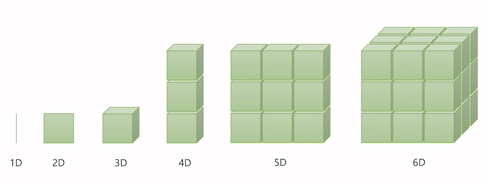
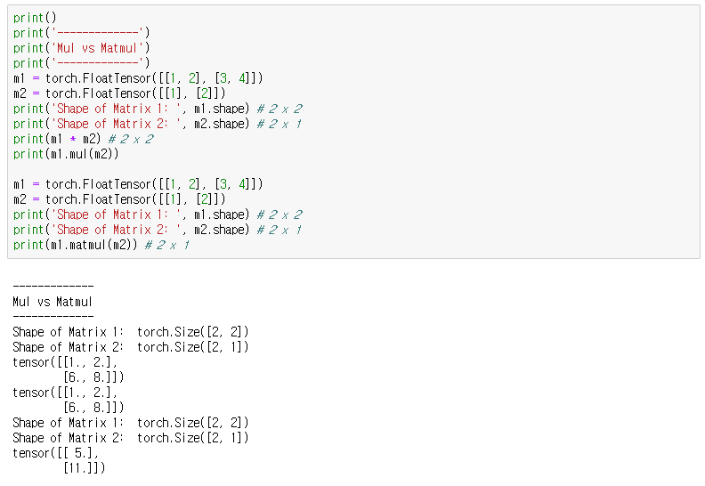

> 해당 포스트는 Deep Learning Zero To All, 모두를 위한 딥러닝 시즌2 PyTorch 강의를 보고 정리한 글입니다.[Zero To All](images/zeroToall.jpg)

## Vector, Matrix and Tensor

차원이 없는 값: 스칼라(Scalar)  
1차원의 값: 벡터(Vector)  
2차원의 값: 행렬(Matrix)  
3차원의 값: 텐서(Tensor)

딥러닝에서의 Tensor Shape Convention  
2D Tensor에 대해 일반적으로 다음과 같이 표현한다. $$|t| = (batch size, dim)$$  
3D Tensor에 대해서는 $$|t| = (batch size, width, height)$$ 또는 $$|t| = (batch size, length, dim)$$로 표현한다.  
3D Tensor의 차이는 이미지 처리, 자연어 처리에 대한 차이에서 온다.

## Numpy vs PyTorch

> 자세한 원본 코드는 [https://github.com/deeplearningzerotoall/PyTorch](https://github.com/deeplearningzerotoall/PyTorch) 에서 확인 가능하다.

### Numpy

- 1차원 Array

```python
t = np.array([0. ,1., 2., 3., 4., 5., 6.])
print(t)
>>> [ 0.  1.  2.  3.  4.  5.  6.]

print('Rank  of t: ', t.ndim)  # .ndim : 차원수 확인
>>> Rank  of t:  1

print('Shape of t: ', t.shape)  # .shape : 형태 확인
>>> Shape of t:  (7,)

# element 확인
print('t[0] t[1] t[-1] = ', t[0], t[1], t[-1])
>>> t[0] t[1] t[-1] =  0.0 1.0 6.0
# slicing
print('t[2:5] t[4:-1]  = ', t[2:5], t[4:-1])
>>> t[2:5] t[4:-1]  =  [ 2.  3.  4.] [ 4.  5.]
print('t[:2] t[3:]     = ', t[:2], t[3:])
>>> t[:2] t[3:]     =  [ 0.  1.] [ 3.  4.  5.  6.]
```

- 2차원 Array

```python
t = np.array([[1., 2., 3.], [4., 5., 6.], [7., 8., 9.], [10., 11., 12.]])
print(t)
>>> [[  1.   2.   3.]
		 [  4.   5.   6.]
		 [  7.   8.   9.]
		 [ 10.  11.  12.]]
print('Rank  of t: ', t.ndim)
>>> Rank  of t:  2
print('Shape of t: ', t.shape)
>>> Shape of t:  (4, 3)
```

### PyTorch

- 1차원 Tensor

```python
t = torch.FloatTensor([0., 1., 2., 3., 4., 5., 6.])
print(t)
>>> tensor([0., 1., 2., 3., 4., 5., 6.])
print(t.dim())  # .dim() : 차원수 확인
>>> 1
print(t.shape)  # .shape : 형태 확인
>>> torch.Size([7])
print(t.size()) # .size() : 형태 확인(shape와 동일)
>>> torch.Size([7])

# element 확인
print(t[0], t[1], t[-1])
>>> tensor(0.) tensor(1.) tensor(6.)
# slicing
print(t[2:5], t[4:-1])
>>> tensor([2., 3., 4.]) tensor([4., 5.])
print(t[:2], t[3:])
>>> tensor([0., 1.]) tensor([3., 4., 5., 6.])
```

- 2차원 Tensor

```python
t = torch.FloatTensor([[1., 2., 3.],
                       [4., 5., 6.],
                       [7., 8., 9.],
                       [10., 11., 12.]
                      ])
print(t)
>>> tensor([[ 1.,  2.,  3.],
		        [ 4.,  5.,  6.],
		        [ 7.,  8.,  9.],
		        [10., 11., 12.]])
print(t.dim())
>>> 2
print(t.size())
>>> torch.Size([4, 3])
print(t[:, 1])
>>> tensor([ 2.,  5.,  8., 11.])
print(t[:, 1].size())
>>> torch.Size([4])
print(t[:, :-1])
>>> tensor([[ 1.,  2.],
		        [ 4.,  5.],
		        [ 7.,  8.],
		        [10., 11.]])
```

- 4차원 Tensor

```python
t = torch.FloatTensor([[[[1, 2, 3, 4],
                         [5, 6, 7, 8],
                         [9, 10, 11, 12]],
                       [[13, 14, 15, 16],
                        [17, 18, 19, 20],
                        [21, 22, 23, 24]]
                       ]])
print(t.dim())
>>> 4
print(t.size())
>>> torch.Size([1, 2, 3, 4])
```

### Broadcasting

텐서 간의 연산을 손쉽게 수행하는 방식으로 사용하기에는 편하지만 행렬이라는 특수성을 고려해야 하는 상황에서 오히려 사용자가 찾아내기 어려운 에러를 야기할 수 있다.

### Multiplication vs Matrix Multiplication



일반적인 행렬의 곱을 생각했을 때, 다음과 같이 계산이 되어야 한다.



그러나 `*` 연산 또는 `mul()` 함수를 통해 계산을 하는 경우 자동을 broadcasting이 되어 다음과 같은 계산이 이루어진다.


즉, $$[1 , 2]$$ 라는 (2, 1) 행렬이

$$
\begin{bmatrix} 
1 & 1 \\ 
2 & 2
\end{bmatrix}
$$

의 (2, 2) 행렬로 변환되어 계산이 이루어진다. 따라서 행렬의 연산을 할 때에는 사용자가 어떤 결과를 원하는지에 따라 연산에 사용하는 함수를 잘 지정해야 한다.

### View(Reshape)

Tensor의 크기를 원하는 사이즈로 변경해주는 함수이다. 이때 주의해야 하는 것은 기존 Tensor의 모든 element가 남거나 부족하지 않게 사용되어야 한다. 예를 들어 다음과 같이 (2, 2, 3) 즉, 모든 elements의 수가 12개인 Tensor가 있을 때,


새로운 크기로 변경하고 싶다면, 12개의 elements가 남김 없이 들어갈 수 있는 크기로만 변경이 가능하다.


만일, 남는 element 또는 부족한 element가 존재한다면, 에러가 발생한다.


하지만 변동성이 커 특정한 크기로 지정을 하기 어려운 경우에 $$-1$$ 을 넣어주면 나머지 크기에 elements를 넣고 남는 elements의 크기로 지정하는 것이 가능하다.


이렇게 PyTorch를 통해 Tensor를 다루는 기본적이며, 중요하다 생각되는 내용을 정리해보았다. 기본적으로 사용법 자체는 Numpy, Tensorflow와 크게 다르지 않으며, 기본 개념은 똑같기 때문에 기존에 Numpy, Tensorflow를 다뤄본 사람이라면 어렵지 않게 익히고 사용할 수 있을 것 같다.
