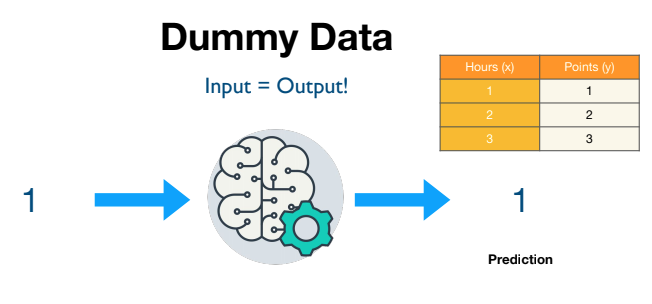
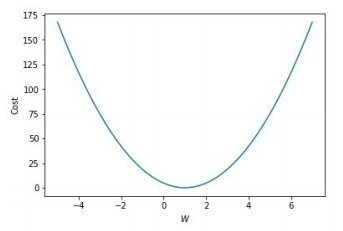

# Deeper Look at Gradient Desenct



## Cost function 이해

**What is the best model?**

예측 값과 실제 값의 차이를 계산한 cost가 작은 hypothesis를 가진 모델이 좋은 모델이다.

위의 더미 데이터를 지난 시간에 소개한 Cost Function인 MSE를 사용하면 다음과 같은 그래프로 그려진다.


해당 그래프로 보았을 때 cost가 가장 작은 지점은 접선의 기울기가 0이 되는 지점이 된다. 따라서 $$W = 1$$일 때, $$cost = 0$$으로 가장 좋은 모델이라고 할 수 있다.

## Gradient descent 이론

이때 cost가 가장 작은 지점인 올바른 W 값을 찾아가는 과정을 'Gradient descent'이라고 한다. 즉, 초기 값에서 경사를 따라 0이 되는 지점을 찾아 내려가는 것이다.

Cost Function 이 다음과 같을 때,
$$ cost(W) = \frac{1}{m} \sum^m_{i=1} \left( Wx^{(i)} - y^{(i)} \right)^2 $$

변화하는 W 값에 대한 수식은 다음과 같다.
$$ \nabla W = \frac{\partial cost}{\partial W} = \frac{2}{m} \sum^m_{i=1} \left( Wx^{(i)} - y^{(i)} \right)x^{(i)} $$

## Gradient descent 구현

직접 Cost Function과 Gradient Descent를 구현하여 학습을 진행하는 코드는 다음과 같다.

```python
# 데이터
x_train = torch.FloatTensor([[1], [2], [3]])
y_train = torch.FloatTensor([[1], [2], [3]])
# 모델 초기화
W = torch.zeros(1)
# learning rate 설정
lr = 0.1

nb_epochs = 10
for epoch in range(nb_epochs + 1):

    # H(x) 계산
    hypothesis = x_train * W

    # cost gradient 계산
    cost = torch.mean((hypothesis - y_train) ** 2)
    gradient = torch.sum((W * x_train - y_train) * x_train)

    print('Epoch {:4d}/{} W: {:.3f}, Cost: {:.6f}'.format(
        epoch, nb_epochs, W.item(), cost.item()
    ))

    # cost gradient로 H(x) 개선
    W -= lr * gradient
```

## Gradient descent 구현 (nn.optim)

PyTorch에서 지원하는 Optimizer 중 하나인 SGD를 사용하여 구현한 코드는 다음과 같다.

```python
# 데이터
x_train = torch.FloatTensor([[1], [2], [3]])
y_train = torch.FloatTensor([[1], [2], [3]])
# 모델 초기화
W = torch.zeros(1, requires_grad=True)
# optimizer 설정
optimizer = optim.SGD([W], lr=0.15)

nb_epochs = 10
for epoch in range(nb_epochs + 1):

    # H(x) 계산
    hypothesis = x_train * W

    # cost 계산
    cost = torch.mean((hypothesis - y_train) ** 2)

    print('Epoch {:4d}/{} W: {:.3f} Cost: {:.6f}'.format(
        epoch, nb_epochs, W.item(), cost.item()
    ))

    # cost로 H(x) 개선
    optimizer.zero_grad()
    cost.backward()
    optimizer.step()
```
